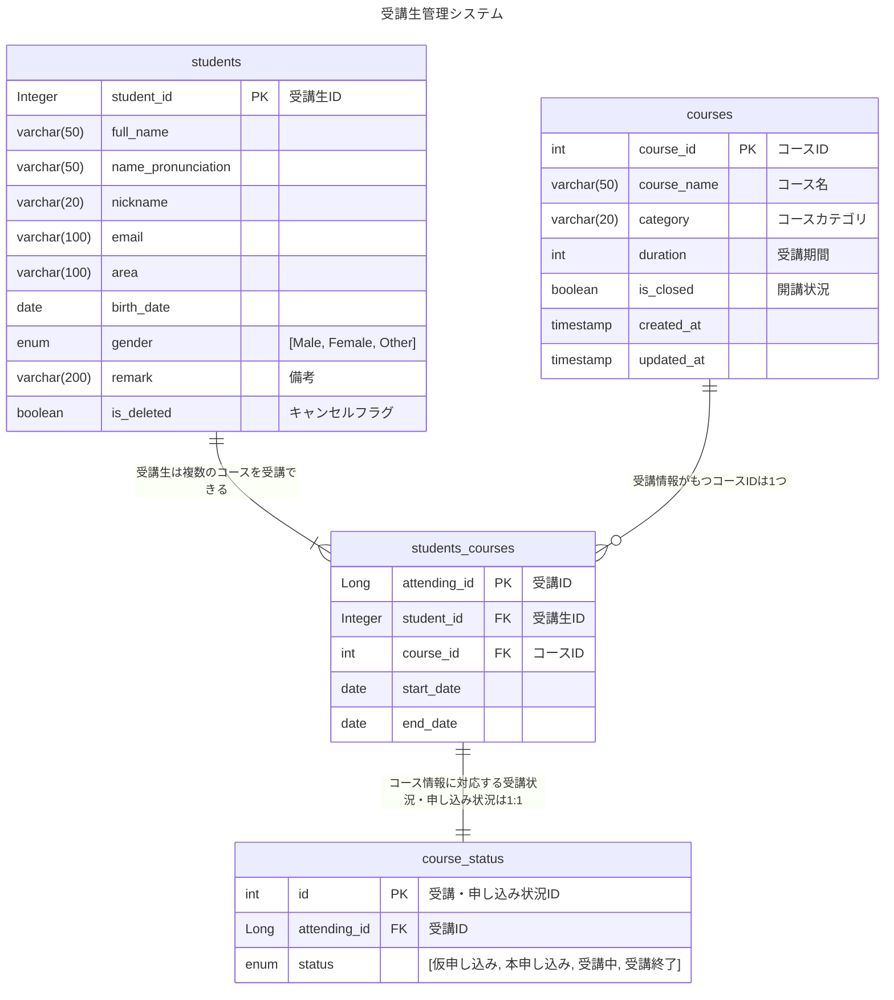

# アプリの概要

スクールの運営支援を行うアプリです。

受講生のプロフィール、受講生が所属しているコースとその受講期間、申し込み状況などを管理できます。

# ER図



# 使用技術

## バックエンド

- Java
- SpringBoot

## インフラ・DB

- AWS
- MySQL

# 機能一覧

|  | 機能 |
| --- | --- |
| 1 | 受講生プロフィールの登録 |
| 2 | 受講生プロフィールの更新 |
| 3 | 受講生プロフィールの削除（論理削除） |
| 4 | 受講生プロフィールの検索 |
| 5 | 受講情報の登録 |
| 6 | 受講情報の更新 |
| 7 | 受講情報の削除 |
| 8 | 受講情報の検索 |
| 9 | 受講状況（ステータス）の登録（コース情報durationから算出） |
| 10 | 受講状況（ステータス）の更新 |
| 11 | 受講状況（ステータス）の削除 |
| 12 | 受講状況（ステータス）の検索 |
| 13 | コースマスタの登録 |
| 14 | コースマスタの更新 |
| 15 | コースマスタの削除 |

### データベース


# 何ができるのか

### 受講生の詳細検索


### コース情報の詳細検索


### ステータス情報の詳細検索


### 受講生プロフィール・コース情報・ステータス複合検索


### クエリパラメータ指定なしの詳細検索（全件検索）


## 工夫したところ（設計面）

1. コースをID管理・マスタテーブルを作成し、今後のコース増減（講師違い・期間違いなど）に柔軟に対応できるよう設計
2. 受講ステータスの終了時期について、コース情報から算出

## 工夫したところ（実装面）

1. 検索において、年齢で検索条件指定を受け取り、内部で誕生日に変換して検索
    
    ```java
    public StudentSearchDTO toDTO() {
    
    	// 年齢指定をbirthDateに置き換え
    	var today = LocalDate.now();
    	var startBirthDate =
    		(maxAge() != null) ? today.minusYears(maxAge() + 1).plusDays(1)
    			: null;
    	var endBirthDate =
    		(minAge() != null) ? today.minusYears(minAge() + 1).minusDays(1)
    			: null;
    
    	// statusをList<String>からList<Status>に変換
    	var statusDTOList = Optional.ofNullable(status())
    				.map(statusList -> statusList.stream().map(Status::valueOf).toList())
    				.orElse(List.of());  // statusがnullの時は空リストList.of()を返す
    
    	// リクエストデータをStudentSearchFormからStudentSearchDTOに詰め替え
    	return new StudentSearchDTO(
    		name(), startBirthDate, endBirthDate, area(), email(), gender(), remark(), courseId(),
    		category(), startDate(), endDate(), statusDTOList);
    
    }
    ```
    
2. 受講情報検索はコースID指定だけでなく、カテゴリ指定でも行えるよう実装
    
    ```xml
    <select id="findCourse" resultType="raisetech.student.management.data.StudentsCourse">
    	SELECT DISTINCT sc.* FROM students_courses sc
    	JOIN courses c ON sc.course_id = c.course_id
    	<where>
    		<if test='courseId != null'>
    			AND sc.course_id = #{courseId}
    		</if>
    		<if test='category != null and !category.isBlank()'>
    			AND c.category = #{category}
    		</if>
    	</where>
    </select>
    ```
    
3. 単体テスト実装
    
    
    
    
    
    
    
    


