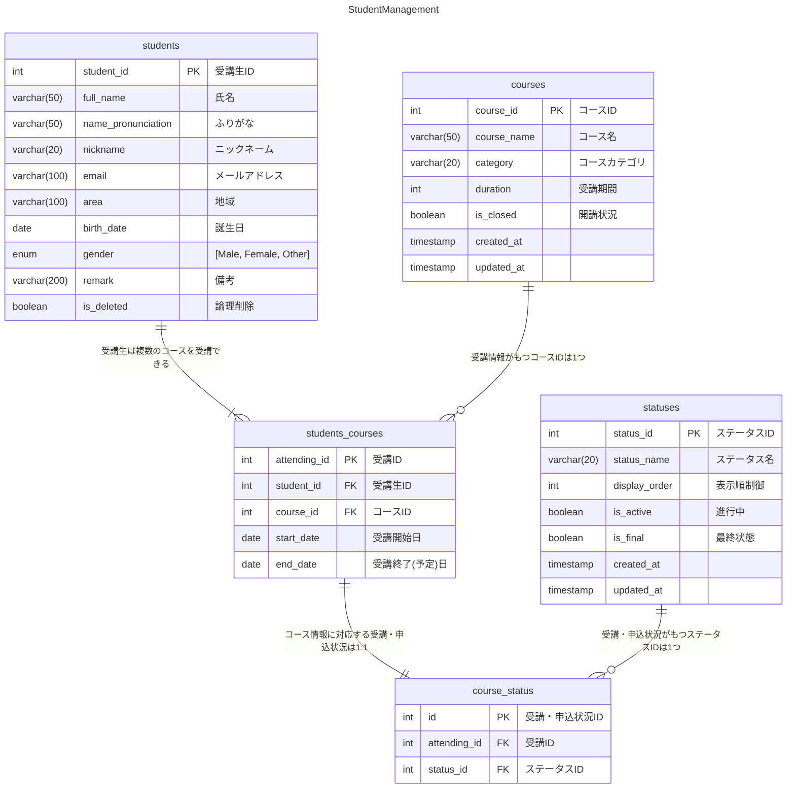

# アプリの概要

スクールの運営支援を行うアプリです。

受講生のプロフィール、受講生が所属しているコースとその受講期間、申し込み状況などを管理できます。

# ER図



# データベース


# 使用技術

## バックエンド

- Java（21.0.5）
- SpringBoot（3.4.1）

## インフラ・DB

- AWS
- MySQL（3.9.4）
- JUnit（5.11.4）

## その他

- Postman
- Git / GitHub
- Docker

# 機能一覧

|    | 機能                        |
|----|---------------------------|
| 1  | 受講生プロフィールの登録              |
| 2  | 受講生プロフィールの更新              |
| 3  | 受講生プロフィールの削除（論理削除）        |
| 4  | 受講生プロフィールの検索（ID指定）        |
| 5  | 受講生プロフィールの詳細検索（条件指定）      |
| 6  | 受講情報の登録                   |
| 7  | 受講情報の更新                   |
| 8  | 受講情報の検索（ID指定）             |
| 9  | 受講情報の検索（条件指定）             |
| 10 | 受講状況（ステータス）の登録            |
| 11 | 受講状況（ステータス）の更新            |
| 12 | 受講状況（ステータス）のクローズ          |
| 13 | 受講状況（ステータス）の検索            |
| 14 | 受講生プロフィール・コース情報・ステータス複合検索 |
| 15 | コースマスタの登録                 |
| 16 | コースマスタの更新                 |
| 17 | コースマスタのクローズ               |
| 18 | コースマスタの全件検索               |

# 何ができるのか

## 受講生情報管理

### 受講生プロフィール・受講情報・受講ステータスの登録


### 受講生プロフィール・受講情報・受講ステータスの更新


### 受講生プロフィールの削除（論理削除）


### 受講生プロフィールの検索（ID指定）


### 受講生プロフィール・受講情報・受講ステータス詳細検索（複合条件指定）


### クエリパラメータ指定なしの詳細検索（全件検索）


## コース情報管理

### コースマスタの全件取得

  

### コースマスタの登録

  

### コースマスタの更新

  

### コースマスタのクローズ

  

## 工夫したところ（設計面）

1. コースをID管理・マスタテーブルを作成し、今後のコース増減（講師違い・期間違いなど）に柔軟に対応できるよう設計
2. 受講状況（ステータス）の終了日について、コース情報から算出
3. 受講ステータスもID管理・マスタテーブルを作成し、ステータスごとの属性・分類ができるよう設計（未実装）


## 工夫したところ（実装面）

1. 検索において、年齢で検索条件指定を受け取り、内部で誕生日に変換して検索

    ```java
    public StudentSearchDTO toDTO() {
    
    	// 年齢指定をbirthDateに置き換え
    	var today = LocalDate.now();
    	var startBirthDate =
    		(maxAge() != null) ? today.minusYears(maxAge() + 1).plusDays(1)
    			: null;
    	var endBirthDate =
    		(minAge() != null) ? today.minusYears(minAge() + 1).minusDays(1)
    			: null;
    
    	// statusをList<String>からList<Status>に変換
    	var statusDTOList = Optional.ofNullable(status())
    				.map(statusList -> statusList.stream().map(Status::valueOf).toList())
    				.orElse(List.of());  // statusがnullの時は空リストList.of()を返す
    
    	// リクエストデータをStudentSearchFormからStudentSearchDTOに詰め替え
    	return new StudentSearchDTO(
    		name(), startBirthDate, endBirthDate, area(), email(), gender(), remark(), courseId(),
    		category(), startDate(), endDate(), statusDTOList);
    
    }
    ```

2. 受講情報検索はコースID指定だけでなく、カテゴリ指定でも行えるよう実装


    ```xml
    <select id="findCourse" resultType="raisetech.student.management.data.StudentsCourse">
    	SELECT DISTINCT sc.* FROM students_courses sc
    	JOIN courses c ON sc.course_id = c.course_id
    	<where>
    		<if test='courseId != null'>
    			AND sc.course_id = #{courseId}
    		</if>
    		<if test='category != null and !category.isBlank()'>
    			AND c.category = #{category}
    		</if>
    	</where>
    </select>
    ```

3. 単体テスト実装
   
   
