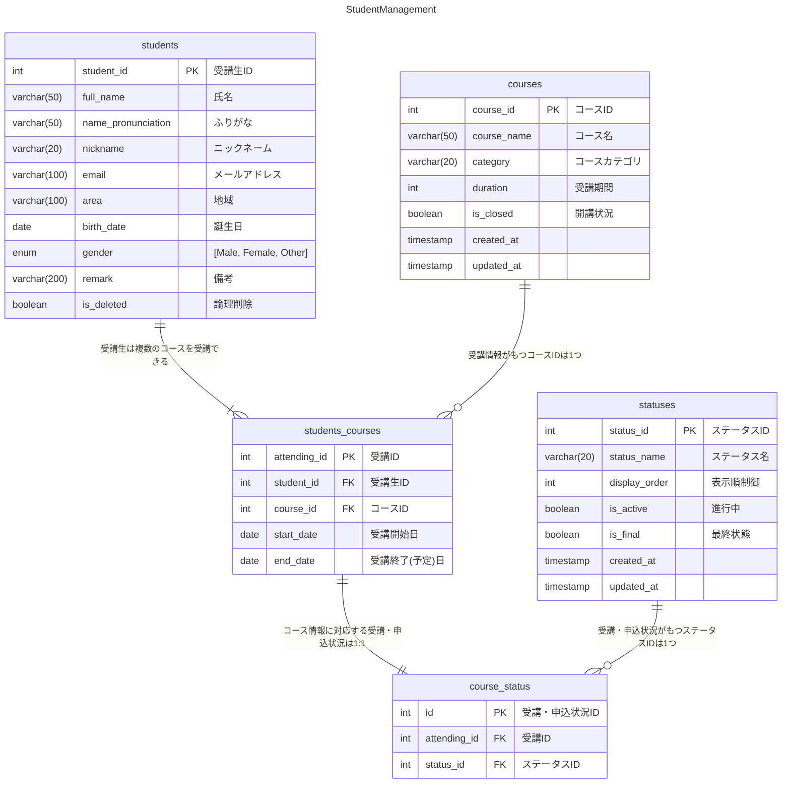
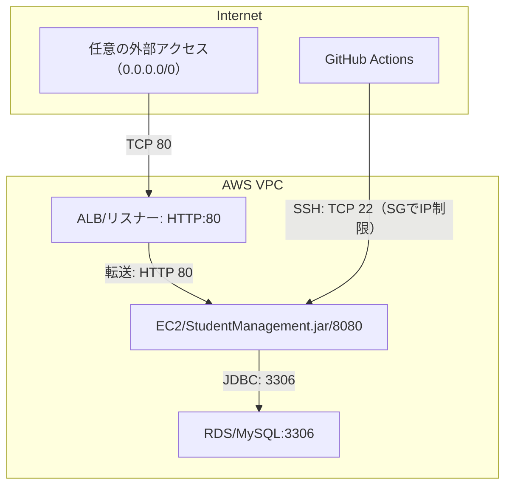

# アプリの概要


オンラインスクールの受講生・コース管理を効率化する内部向け管理システムアプリです。

受講生のプロフィール、受講生が所属しているコースとその受講期間、申し込み状況などを管理できます。

## 開発の背景と目的

本アプリケーションは、
**JavaとSpring BootによるWebアプリケーション開発を学習する目的で作成したポートフォリオ作品**です。

当初は**スクール課題の一環**として開発を始めましたが、より実用性の高いものにするため使用現場を想定し、以下のような工夫や拡張を自ら行いました：

- **コース情報・受講ステータスマスタを導入し、IDによる一元管理**を実現
- **履歴管理可能な受講状況テーブル**を設計し、状態遷移を記録できるように
- **複数条件での直感的な検索機能**を実装し、実務でも活用しやすい構成に

### 解決したかった課題

個人経営のスクールや小規模な講座運営では、以下のような悩みが生じがちです：

- Excelや紙ベースでの管理に限界がある
- 受講生の申込状況や進捗を把握しづらい
- コースごとの傾向やニーズの分析が難しい

このような課題を想定し、本アプリでは**受講生・コース・受講状況の一元管理と柔軟な検索機能**
を提供することで、業務効率と視認性の向上を図ることを目的としています。

### 想定する利用者と運用シーン

- スクール運営者、個人講師、社内研修の教育担当者
- 講座の受講管理・申込管理・進捗把握を効率化したい方

# ER図



# データベース


# インフラ構成図


# 使用技術

## バックエンド

- Java（21.0.5）
- SpringBoot（3.4.1）

## インフラ・DB

- AWS
- Docker
- MySQL（3.9.4）
- GitHub Actions (CI/CD)

## テスト

- JUnit（5.11.4）

## ツール

- Postman
- Git / GitHub

# 機能一覧

|    | 機能                        |
|----|---------------------------|
| 1  | 受講生プロフィールの登録              |
| 2  | 受講生プロフィールの更新              |
| 3  | 受講生プロフィールの削除（論理削除）        |
| 4  | 受講生プロフィールの検索（ID指定）        |
| 5  | 受講生プロフィールの詳細検索（条件指定）      |
| 6  | 受講情報の登録                   |
| 7  | 受講情報の更新                   |
| 8  | 受講情報の検索（ID指定）             |
| 9  | 受講情報の検索（条件指定）             |
| 10 | 受講状況（ステータス）の登録            |
| 11 | 受講状況（ステータス）の更新            |
| 12 | 受講状況（ステータス）のクローズ          |
| 13 | 受講状況（ステータス）の検索            |
| 14 | 受講生プロフィール・コース情報・ステータス複合検索 |
| 15 | コースマスタの登録                 |
| 16 | コースマスタの更新                 |
| 17 | コースマスタのクローズ               |
| 18 | コースマスタの全件検索               |

# 何ができるのか

## 受講生情報管理

### 受講生プロフィール・受講情報・受講ステータスの登録


### 受講生プロフィール・受講情報・受講ステータスの更新


### 受講生プロフィールの削除（論理削除）


### 受講生プロフィールの検索（ID指定）


### 受講生プロフィール・受講情報・受講ステータス詳細検索（複合条件指定）


### クエリパラメータ指定なしの詳細検索（全件検索）


## コース情報管理

### コースマスタの全件取得

  

### コースマスタの登録

  

### コースマスタの更新

  

### コースマスタのクローズ

  

## 工夫したところ（設計面）

1. コースをID管理・マスタテーブルを作成し、今後のコース増減（講師違い・期間違いなど）に柔軟に対応できるよう設計
2. 受講状況（ステータス）の終了日について、コース情報から算出
3. 受講ステータスもID管理・マスタテーブルを作成し、ステータスごとの属性・分類ができるよう設計（未実装）

## 工夫したところ（実装面）

### 1. 検索において、年齢で検索条件指定を受け取り、内部で誕生日に変換して検索

    ```java
    public StudentSearchDTO toDTO() {
    
    	// 年齢指定をbirthDateに置き換え
    	var today = LocalDate.now();
    	var startBirthDate =
    		(maxAge() != null) ? today.minusYears(maxAge() + 1).plusDays(1)
    			: null;
    	var endBirthDate =
    		(minAge() != null) ? today.minusYears(minAge() + 1).minusDays(1)
    			: null;
    
    	// statusをList<String>からList<Status>に変換
    	var statusDTOList = Optional.ofNullable(status())
    				.map(statusList -> statusList.stream().map(Status::valueOf).toList())
    				.orElse(List.of());  // statusがnullの時は空リストList.of()を返す
    
    	// リクエストデータをStudentSearchFormからStudentSearchDTOに詰め替え
    	return new StudentSearchDTO(
    		name(), startBirthDate, endBirthDate, area(), email(), gender(), remark(), courseId(),
    		category(), startDate(), endDate(), statusDTOList);
    
    }
    ```

### 2. 受講情報検索はコースID指定だけでなく、カテゴリ指定でも行えるよう実装

    ```xml
    <select id="findCourse" resultType="raisetech.student.management.data.StudentsCourse">
    	SELECT DISTINCT sc.* FROM students_courses sc
    	JOIN courses c ON sc.course_id = c.course_id
    	<where>
    		<if test='courseId != null'>
    			AND sc.course_id = #{courseId}
    		</if>
    		<if test='category != null and !category.isBlank()'>
    			AND c.category = #{category}
    		</if>
    	</where>
    </select>
    ```

### 3. テスト（JUnit）

本プロジェクトでは、**JUnit 5** による単体テストを実装しています。主に以下の観点で検証を行っています：

- サービスクラスのビジネスロジックの正当性
- リポジトリ層のクエリ動作確認
- REST API レスポンスの妥当性（MockMVC利用時）

CI/CDパイプラインにおいて、`main` ブランチへの push/pull_request 時に **自動的にテストが実行**
され、品質チェックが行われます。

   
   

### 4. DevOps・インフラ構成

本アプリケーションは、**AWS環境**にデプロイされており、**GitHub Actionsを用いたCI/CDパイプライン**
を構築しています。これにより、ソースコードの変更が自動的にビルド・テスト・デプロイまで反映され、開発と運用を効率化しています。

#### CI/CD構成（GitHub Actions）

- **CI（継続的インテグレーション）**
    - プルリクエスト作成時にJUnitによる自動テストを実行
    - テスト結果に基づいてマージ可否を判断

- **CD（継続的デプロイ）**
    - `main`ブランチへのマージで以下の処理を自動実行：
        1. Javaアプリケーションのビルド
        2. EC2へのSSH接続によるアプリケーション再起動（デプロイスクリプト実行）

#### インフラ環境（AWS）

| 項目     | 技術/サービス                     |
|--------|-----------------------------|
| サーバー   | Amazon EC2（Docker 実行）       |
| データベース | Amazon RDS（MySQL）           |
| CI/CD  | GitHub Actions + Shellスクリプト |
| 接続方式   | SSH・パブリックIP経由               |

#### EC2構成



> - **インスタンスタイプ**: t2.micro（検証用の最小構成）
> - **OS**: Amazon Linux 2023
> - **Webアプリのデプロイ先**: `/home/ec2-user/StudentManagement.jar`
> - **systemdでサービス化**: `StudentManagement.service` により起動管理

#### セキュリティグループ構成（開発用）

| ポート番号 | プロトコル | 用途                   | 接続元            | 接続先                    |
|-------|-------|----------------------|----------------|------------------------|
| 22    | TCP   | EC2インスタンスへのSSH接続     | 管理者のPC（固定IPなど） | EC2インスタンス（Linuxサーバー）   |
| 80    | HTTP  | Webアクセスの受け口（ALB）     | インターネット        | ALB                    |
| 8080  | HTTP  | アプリケーションのWeb API用ポート | ALB            | EC2インスタンス上のSpring Boot |
| 3306  | JDBC  | アプリケーション→DB接続（MySQL） | EC2インスタンス      | RDS（MySQL）             |

#### アクセス情報（例）

| 種別       | URL                                                                                |
|----------|------------------------------------------------------------------------------------|
| パブリックIP  | `http://57.180.9.102`                                                              |
| ALB経由URL | `http://StudentManagementALB-1511570873.ap-northeast-1.elb.amazonaws.com/students` |

> **※ 注意**
> - EC2はコスト削減のため通常は停止状態にしており、常時アクセス可能な状態ではありません。
> - アクセス時は必要に応じてインスタンスを起動する必要があります。
> - EC2インスタンスのパブリックIPアドレスは、再起動ごとに変更されます。
