# 📚 Student Management App


オンラインスクールの受講生・コース管理を効率化する内部向け管理システムアプリです。

受講生のプロフィール、受講生が所属しているコースとその受講期間、申し込み状況などを管理できます。

## 開発の背景と目的

本アプリケーションは、
**JavaとSpring BootによるWebアプリケーション開発を学習する目的で作成したポートフォリオ作品**です。

当初は**スクール課題の一環**として開発を始めましたが、より実用性の高いものにするため使用現場を想定し、以下のような工夫や拡張を自ら行いました：

- **コース情報・受講ステータスマスタを導入し、IDによる一元管理**を実現
- **履歴管理可能な受講状況テーブル**を設計し、状態遷移を記録できるように
- **複数条件での直感的な検索機能**を実装し、実務でも活用しやすい構成に

### 解決したかった課題

個人経営のスクールや小規模な講座運営では、以下のような悩みが生じがちです：

- Excelや紙ベースでの管理に限界がある
- 受講生の申込状況や進捗を把握しづらい
- コースごとの傾向やニーズの分析が難しい

このような課題を想定し、本アプリでは**受講生・コース・受講状況の一元管理と柔軟な検索機能**
を提供することで、業務効率と視認性の向上を図ることを目的としています。

### 想定する利用者と運用シーン

- スクール運営者、個人講師、社内研修の教育担当者
- 講座の受講管理・申込管理・進捗把握を効率化したい方

## アプリケーションの実行方法（Docker使用）

以下の手順でアプリケーションをローカル環境に構築・起動できます。

### 前提条件

- [Docker](https://www.docker.com/products/docker-desktop)
  および [Docker Compose](https://docs.docker.com/compose/) がインストール済み
- Java 21（ホストには不要、Docker内で動作）
- Git / ターミナル環境があること

### ディレクトリ構成（抜粋）

```
.
├── build.gradle
├── docker/
│   ├── Dockerfile
│   ├── docker-compose.yml
│   ├── app.env
│   ├── start.sh
│   └── mysql/
│       └── init.sql
└── src/
```

### 環境変数の設定

`docker/app.env` に環境変数を定義しています：

```env
SPRING_PROFILES_ACTIVE=dev
MYSQL_USER=root
MYSQL_PASSWORD=rootroot
MYSQL_DATABASE=StudentManagement
```

### 初期化SQL

MySQL 初期化用のSQLファイルは以下に配置されています：

```
docker/mysql/init.sql
```

初回起動時に自動的に以下が実行されます：

- テーブル作成
- マスタデータ（status, course）挿入
  ※ MySQL のデータがすでに存在する場合は再実行されません。

### 起動手順

1. リポジトリをクローン
    ```bash
    git clone https://github.com/aym0546/student.management.git
    cd student.management
    ```

2. 起動スクリプトの実行（推奨）
    ```bash
    bash docker/start.sh
    ```
   > start.sh 内部で以下を実行しています：
   > - `./gradlew build`（jarファイル生成）
   > - `docker-compose up --build`

### アクセス方法

アプリケーションは以下のURLで利用可能です：

[http://localhost:8080](http://localhost:8080)

### 補助スクリプト（任意）

#### アプリケーションの停止

```bash
bash docker/stop.sh
```

#### ログ確認

```bash
bash docker/log.sh
```

# ER図

```mermaid
---
title: "StudentManagement"
---

erDiagram
    students ||--|{ students_courses: "受講生は複数のコースを受講できる"
    students_courses ||--|| course_status: "コース情報に対応する受講・申込状況は1:1"
    courses ||--o{ students_courses: "受講情報がもつコースIDは1つ"
    statuses ||--o{ course_status: "受講・申込状況がもつステータスIDは1つ"

    students {
        int student_id PK "受講生ID"
        varchar(50) full_name "氏名"
        varchar(50) name_pronunciation "ふりがな"
        varchar(20) nickname "ニックネーム"
        varchar(100) email "メールアドレス"
        varchar(100) area "地域"
        date birth_date "誕生日"
        enum gender "[Male, Female, Other]"
        varchar(200) remark "備考"
        boolean is_deleted "論理削除"
    }

    students_courses {
        int attending_id PK "受講ID"
        int student_id FK "受講生ID"
        int course_id FK "コースID"
        date start_date "受講開始日"
        date end_date "受講終了(予定)日"
    }

    courses {
        int course_id PK "コースID"
        varchar(50) course_name "コース名"
        varchar(20) category "コースカテゴリ"
        int duration "受講期間"
        boolean is_closed "開講状況"
        timestamp created_at
        timestamp updated_at
    }

    course_status {
        int id PK "受講・申込状況ID"
        int attending_id FK "受講ID"
        int status_id FK "ステータスID"
    }

    statuses {
        int status_id PK "ステータスID"
        varchar(20) status_name "ステータス名"
        int display_order "表示順制御"
        boolean is_active "進行中"
        boolean is_final "最終状態"
        timestamp created_at
        timestamp updated_at
    }
```



# データベース


# インフラ構成図


# 使用技術

## バックエンド

- Java（21.0.5）
- SpringBoot（3.4.1）

## インフラ・DB

- AWS
- Docker
- MySQL（9.1.0）
- GitHub Actions (CI/CD)

## テスト

- JUnit（5.11.4）

## ツール

- Postman
- Git / GitHub

# 機能一覧

|    | 機能                        |
|----|---------------------------|
| 1  | 受講生プロフィールの登録              |
| 2  | 受講生プロフィールの更新              |
| 3  | 受講生プロフィールの削除（論理削除）        |
| 4  | 受講生プロフィールの検索（ID指定）        |
| 5  | 受講生プロフィールの詳細検索（条件指定）      |
| 6  | 受講情報の登録                   |
| 7  | 受講情報の更新                   |
| 8  | 受講情報の検索（ID指定）             |
| 9  | 受講情報の検索（条件指定）             |
| 10 | 受講状況（ステータス）の登録            |
| 11 | 受講状況（ステータス）の更新            |
| 12 | 受講状況（ステータス）のクローズ          |
| 13 | 受講状況（ステータス）の検索            |
| 14 | 受講生プロフィール・コース情報・ステータス複合検索 |
| 15 | コースマスタの登録                 |
| 16 | コースマスタの更新                 |
| 17 | コースマスタのクローズ               |
| 18 | コースマスタの全件検索               |

# 何ができるのか

## 受講生情報管理

### 受講生プロフィール・受講情報・受講ステータスの登録


### 受講生プロフィール・受講情報・受講ステータスの更新


### 受講生プロフィールの削除（論理削除）


### 受講生プロフィールの検索（ID指定）


### 受講生プロフィール・受講情報・受講ステータス詳細検索（複合条件指定）


### クエリパラメータ指定なしの詳細検索（全件検索）


## コース情報管理

### コースマスタの全件取得

  

### コースマスタの登録

  

### コースマスタの更新

  

### コースマスタのクローズ

  

## 工夫したところ（設計面）

1. コースをID管理・マスタテーブルを作成し、今後のコース増減（講師違い・期間違いなど）に柔軟に対応できるよう設計
2. 受講状況（ステータス）の終了日について、コース情報から算出
3. 受講ステータスもID管理・マスタテーブルを作成し、ステータスごとの属性・分類ができるよう設計（未実装）

## 工夫したところ（実装面）

### 1. 検索において、年齢で検索条件指定を受け取り、内部で誕生日に変換して検索

    ```java
    public StudentSearchDTO toDTO() {
    
    	// 年齢指定をbirthDateに置き換え
    	var today = LocalDate.now();
    	var startBirthDate =
    		(maxAge() != null) ? today.minusYears(maxAge() + 1).plusDays(1)
    			: null;
    	var endBirthDate =
    		(minAge() != null) ? today.minusYears(minAge() + 1).minusDays(1)
    			: null;
    
    	// statusをList<String>からList<Status>に変換
    	var statusDTOList = Optional.ofNullable(status())
    				.map(statusList -> statusList.stream().map(Status::valueOf).toList())
    				.orElse(List.of());  // statusがnullの時は空リストList.of()を返す
    
    	// リクエストデータをStudentSearchFormからStudentSearchDTOに詰め替え
    	return new StudentSearchDTO(
    		name(), startBirthDate, endBirthDate, area(), email(), gender(), remark(), courseId(),
    		category(), startDate(), endDate(), statusDTOList);
    
    }
    ```

### 2. 受講情報検索はコースID指定だけでなく、カテゴリ指定でも行えるよう実装

    ```xml
    <select id="findCourse" resultType="raisetech.student.management.data.StudentsCourse">
    	SELECT DISTINCT sc.* FROM students_courses sc
    	JOIN courses c ON sc.course_id = c.course_id
    	<where>
    		<if test='courseId != null'>
    			AND sc.course_id = #{courseId}
    		</if>
    		<if test='category != null and !category.isBlank()'>
    			AND c.category = #{category}
    		</if>
    	</where>
    </select>
    ```

### 3. テスト（JUnit）

本プロジェクトでは、**JUnit 5** による単体テストを実装しています。主に以下の観点で検証を行っています：

- サービスクラスのビジネスロジックの正当性
- リポジトリ層のクエリ動作確認
- REST API レスポンスの妥当性（MockMVC利用時）

CI/CDパイプラインにおいて、`main` ブランチへの push/pull_request 時に **自動的にテストが実行**
され、品質チェックが行われます。

   
   

### 4. DevOps・インフラ構成

#### CI/CD構成（GitHub Actions）

本アプリケーションは、**AWS環境**にデプロイされており、**GitHub Actionsを用いたCI/CDパイプライン**
を構築しています。これにより、ソースコードの変更が自動的にビルド・テスト・デプロイまで反映され、開発と運用を効率化しています。

- **CI（継続的インテグレーション）**
    - **目的**：ソースコードの品質を担保し、問題のある変更を未然に防ぐ
    - **トリガー**：プルリクエスト作成時
    - **実行内容**：
        - `JUnit` による自動テストを実行
        - テスト結果に応じてマージの可否を判断

- **CD（継続的デプロイ）**
    - **目的**：安全かつ迅速に本番環境へアプリケーションを反映
    - **トリガー**：`main`ブランチへのマージ
    - **実行内容**：
        1. Javaアプリケーションのビルド
        2. SSHでEC2サーバーに接続
        3. デプロイスクリプトを実行し、アプリケーションを再起動

#### インフラ環境（AWS）

| 項目     | 技術/サービス                     |
|--------|-----------------------------|
| サーバー   | Amazon EC2（Docker 実行）       |
| データベース | Amazon RDS（MySQL）           |
| CI/CD  | GitHub Actions + Shellスクリプト |
| 接続方式   | SSH・パブリックIP経由               |

#### EC2構成

```mermaid
graph TD
    subgraph Internet
        Client1["任意の外部アクセス（0.0.0.0/0）"]
        GitHubActions["GitHub Actions"]
    end

    subgraph AWS VPC
        ALB["ALB/リスナー: HTTP:80"]
        EC2["EC2/StudentManagement.jar/8080"]
        RDS["RDS/MySQL:3306"]
    end

    Client1 -->|TCP 80| ALB
    ALB -->|転送: HTTP 80| EC2
    GitHubActions -->|SSH: TCP 22（SGでIP制限）| EC2
    EC2 -->|JDBC: 3306| RDS
```



> - **インスタンスタイプ**: t2.micro（検証用の最小構成）
> - **OS**: Amazon Linux 2023
> - **Webアプリのデプロイ先**: `/home/ec2-user/StudentManagement.jar`
> - **systemdでサービス化**: `StudentManagement.service` により起動管理

#### セキュリティグループ構成（開発用）

| ポート番号 | プロトコル | 用途                   | 接続元            | 接続先                    |
|-------|-------|----------------------|----------------|------------------------|
| 22    | TCP   | EC2インスタンスへのSSH接続     | 管理者のPC（固定IPなど） | EC2インスタンス（Linuxサーバー）   |
| 80    | HTTP  | Webアクセスの受け口（ALB）     | インターネット        | ALB                    |
| 8080  | HTTP  | アプリケーションのWeb API用ポート | ALB            | EC2インスタンス上のSpring Boot |
| 3306  | JDBC  | アプリケーション→DB接続（MySQL） | EC2インスタンス      | RDS（MySQL）             |

#### アクセス情報（例）

| 種別       | URL                                                                                |
|----------|------------------------------------------------------------------------------------|
| パブリックIP  | `http://57.180.9.102`                                                              |
| ALB経由URL | `http://StudentManagementALB-1511570873.ap-northeast-1.elb.amazonaws.com/students` |

> **※ 注意**
> - EC2はコスト削減のため通常は停止状態にしており、常時アクセス可能な状態ではありません。
> - アクセス時は必要に応じてインスタンスを起動する必要があります。
> - EC2インスタンスのパブリックIPアドレスは、再起動ごとに変更されます。

## 今後の展望

- ステータスマスタに `遷移ルール` を追加し、状態遷移の制御を実装予定
- Elasticsearch連携による全文検索
- フロントエンドのSPA化（React予定）
