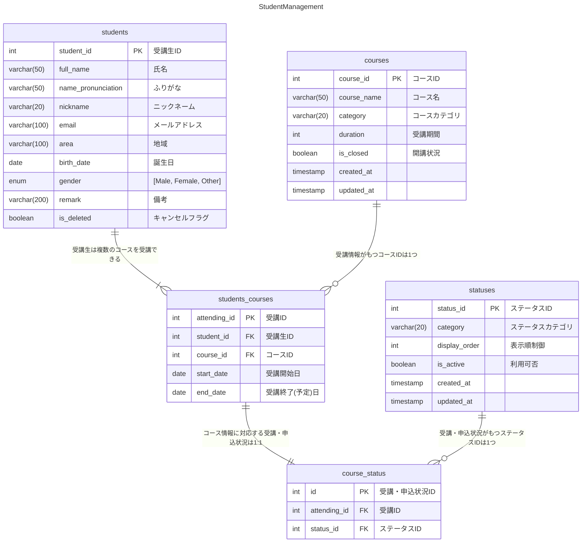

```mermaid
---
title: "StudentManagement"
---

erDiagram
    students ||--|{ students_courses: "受講生は複数のコースを受講できる"
    students_courses ||--|| course_status: "コース情報に対応する受講・申込状況は1:1"
    courses ||--o{ students_courses: "受講情報がもつコースIDは1つ"
    statuses ||--o{ course_status: "受講・申込状況がもつステータスIDは1つ"

    students {
        int student_id PK "受講生ID"
        varchar(50) full_name "氏名"
        varchar(50) name_pronunciation "ふりがな"
        varchar(20) nickname "ニックネーム"
        varchar(100) email "メールアドレス"
        varchar(100) area "地域"
        date birth_date "誕生日"
        enum gender "[Male, Female, Other]"
        varchar(200) remark "備考"
        boolean is_deleted "キャンセルフラグ"
    }

    students_courses {
        int attending_id PK "受講ID"
        int student_id FK "受講生ID"
        int course_id FK "コースID"
        date start_date "受講開始日"
        date end_date "受講終了(予定)日"
    }

    courses {
        int course_id PK "コースID"
        varchar(50) course_name "コース名"
        varchar(20) category "コースカテゴリ"
        int duration "受講期間"
        boolean is_closed "開講状況"
        timestamp created_at
        timestamp updated_at
    }

    course_status {
        int id PK "受講・申込状況ID"
        int attending_id FK "受講ID"
        int status_id FK "ステータスID"
    }

    statuses {
        int status_id PK "ステータスID"
        varchar(20) category "ステータスカテゴリ"
        int display_order "表示順制御"
        boolean is_active "利用可否"
        timestamp created_at
        timestamp updated_at
    }
```
