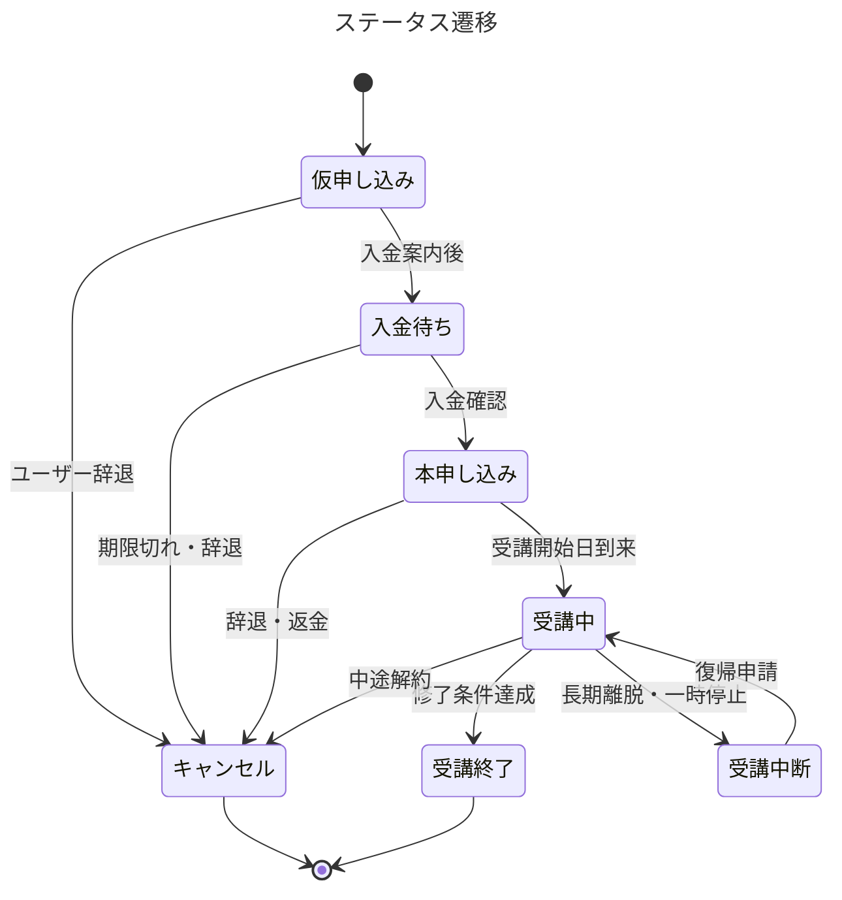
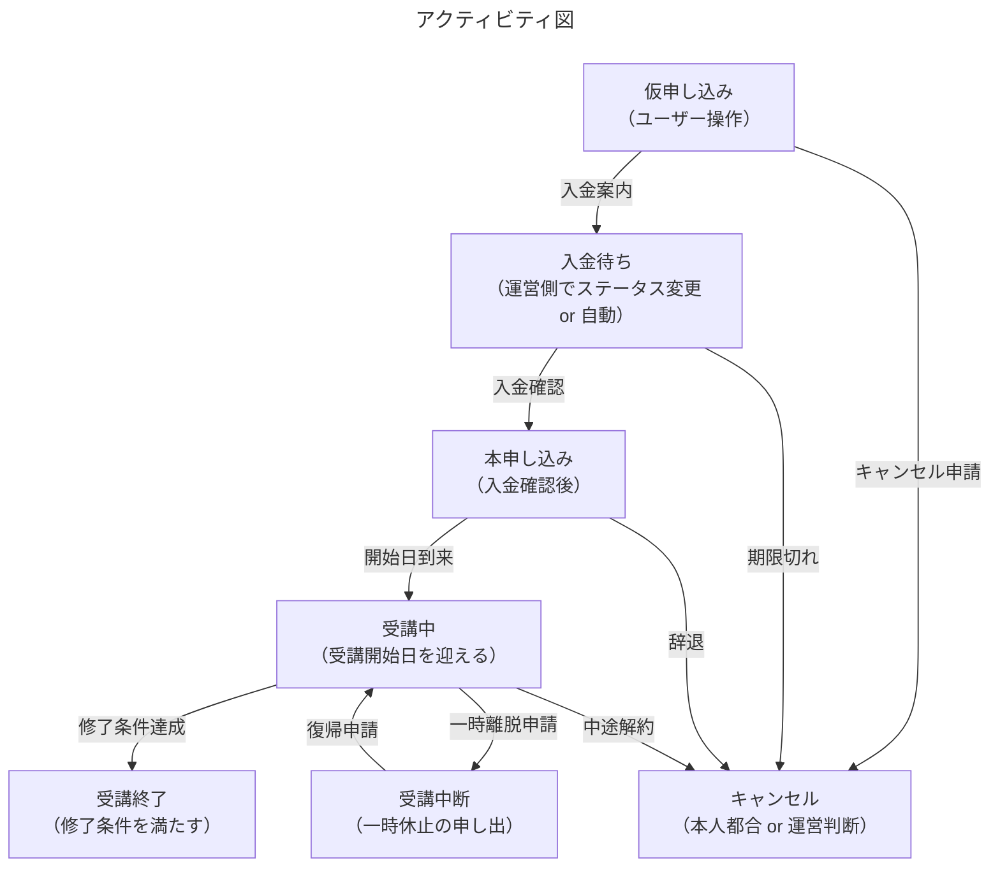
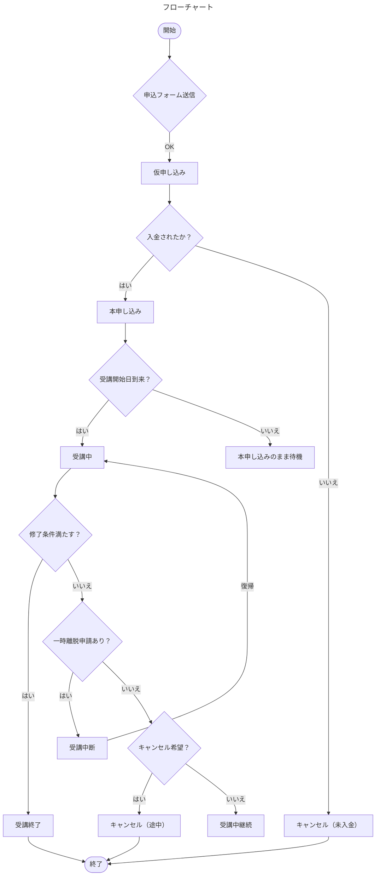

```mermaid
---
title: "ステータス遷移"
---
stateDiagram-v2
    [*] --> 仮申し込み
    仮申し込み --> 入金待ち: 入金案内後
    仮申し込み --> キャンセル: ユーザー辞退
    入金待ち --> 本申し込み: 入金確認
    入金待ち --> キャンセル: 期限切れ・辞退
    本申し込み --> 受講中: 受講開始日到来
    本申し込み --> キャンセル: 辞退・返金
    受講中 --> 受講終了: 修了条件達成
    受講中 --> 受講中断: 長期離脱・一時停止
    受講中断 --> 受講中: 復帰申請
    受講中 --> キャンセル: 中途解約
    キャンセル --> [*]
    受講終了 --> [*]

```

```mermaid
---
title: "アクティビティ図"
---
flowchart TD
    A[仮申し込み<br>（ユーザー操作）]
B[入金待ち<br>（運営側でステータス変更 or 自動）]
C[本申し込み<br>（入金確認後）]
D[受講中<br>（受講開始日を迎える）]
E[受講終了<br>（修了条件を満たす）]
F[受講中断<br>（一時休止の申し出）]
G[キャンセル<br>（本人都合 or 運営判断）]

A -->|入金案内|B
A -->|キャンセル申請|G
B -->|入金確認|C
B -->|期限切れ|G
C -->|開始日到来| D
C -->|辞退|G
D -->|修了条件達成|E
D -->|一時離脱申請|F
D -->|中途解約|G
F -->|復帰申請|D
```

```mermaid
---
title: "フローチャート"
---
flowchart TD
    Start([開始]) --> Q1{申込フォーム送信}
    Q1 -->|OK| 仮申込[仮申し込み]
    仮申込 --> Q2{入金されたか？}
Q2 -->|はい|本申込[本申し込み]
Q2 -->|いいえ|キャンセル1[キャンセル（未入金）]

本申込 --> Q3{受講開始日到来？}
Q3 -->|はい|受講中[受講中]
Q3 -->|いいえ|保留1[本申し込みのまま待機]

受講中 --> Q4{修了条件満たす？}
Q4 -->|はい|修了[受講終了]
Q4 -->|いいえ|Q5{一時離脱申請あり？}

Q5 -->|はい| 中断[受講中断] -->|復帰|受講中
Q5 -->|いいえ|Q6{キャンセル希望？}
Q6 -->|はい|キャンセル2[キャンセル（途中）]
Q6 -->|いいえ|継続[受講中継続]

修了 --> End([終了])
キャンセル1 --> End
キャンセル2 --> End

```
