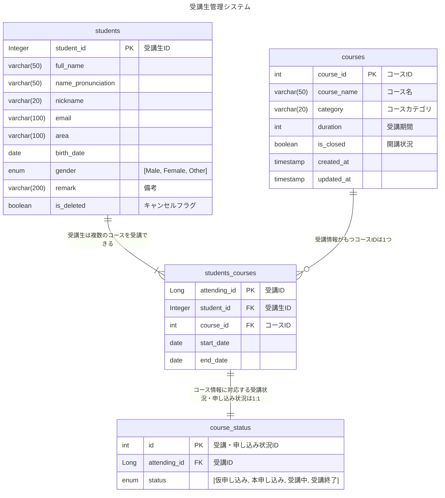

```mermaid
---
title: "受講生管理システム"
---

erDiagram
    students ||--|{ students_courses: "受講生は複数のコースを受講できる"
    students_courses ||--|| course_status: "コース情報に対応する受講状況・申し込み状況は1:1"
    courses ||--o{ students_courses: "受講情報がもつコースIDは1つ"

    students {
        Integer student_id PK "受講生ID"
        varchar(50) full_name
        varchar(50) name_pronunciation
        varchar(20) nickname
        varchar(100) email
        varchar(100) area
        date birth_date
        enum gender "[Male, Female, Other]"
        varchar(200) remark "備考"
        boolean is_deleted "キャンセルフラグ"
    }

    students_courses {
        Long attending_id PK "受講ID"
        Integer student_id FK "受講生ID"
        int course_id FK "コースID"
        date start_date
        date end_date
    }

    course_status {
        int id PK "受講・申し込み状況ID"
        Long attending_id FK "受講ID"
        enum status "[仮申し込み, 本申し込み, 受講中, 受講終了]"
    }

    courses {
        int course_id PK "コースID"
        varchar(50) course_name "コース名"
        varchar(20) category "コースカテゴリ"
        int duration "受講期間"
        boolean is_closed "開講状況"
        timestamp created_at
        timestamp updated_at
    }
```
